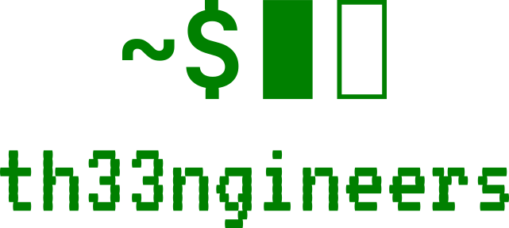

# The Engineers Landing Page
Hey there, we are The Engineers. AI guys. What we can do for you is to help you translate keywords like AI or LLM into real business value with our products or help you bootstrap your projects, enable your engineers. Yeah, our landing page sucks a bit, we know, however for now we'd rather focus on building cool, exciting and meaningful stuff hence this snarky remark as a justification.


# Setup

Clone repo:

```bash
git clone https://github.com/th33ngineers/landing-page.git
```

Open index.html

# Tech

Tech used:

- HTML
- CSS

## Contributing

1. Fork the Project/Clone repo
2. Create your Feature Branch (`git checkout -b feat/AmazingFeature`)
3. Commit your Changes (`git commit -m 'feat: add some AmazingFeature'`)
4. Push to the Branch (`git push origin feat/AmazingFeature`)
5. Open a Pull Request

<!-- LICENSE -->

## License

© 2020-2023 ONIONMINDSET SP. Z O.O., KOZIENICE All Rights Reserved

<!-- CONTACT -->

## Contact

Błażej Stępień - [@blazst](https://github.com/blazst) - blazej.stepien@theengineers.tech

Marcin Woźniak - [@martwozniak](https://github.com/martwozniak) - marcin.wozniak@theengineers.tech

Project Link: [https://github.com/th33ngineers/landing-page](https://github.com/th33ngineers/landing-page)